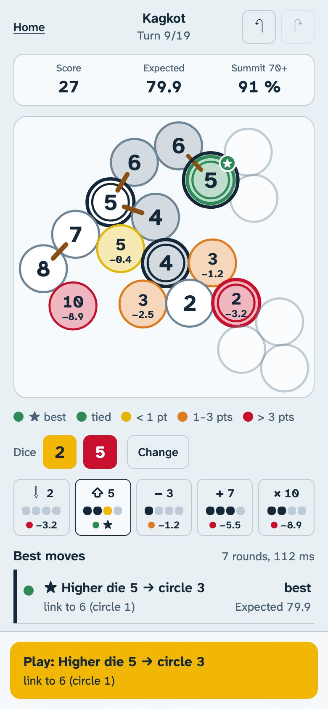

# Trek12 Sherpa

Unofficial best-move advisor for the roll-and-write board game **Trek 12**. Enter the two dice; the
sheet lights up with what each circle is worth, and the advisor tells you which operation to use,
where to write the result and which rope links to draw.

**Open the app: <https://smetay.github.io/trek12-sherpa/>** · works offline, on your phone, at the table.

<p align="center">
  
</p>

## What it does

- **Reads like your sheet.** Every circle you can play shows the number you would write there and how
  many expected points that choice loses against the best one. Green means best or statistically
  tied, then yellow, orange and red as the loss grows. The best circle carries a ★.
- **Plays the whole ascent with you.** Dice in, advice in about a second, one tap to play, whether you
  follow the recommended move or pick your own. Undo, redo, and the game survives closing the app.
- **Honest about uncertainty.** Moves whose difference is within the noise of the simulation are shown
  as tied instead of pretending one is better.
- **Private and offline.** Everything runs in your browser: no account, no server, no tracking.
- The three base-game sheets (Dunai, Kagkot, Dhaulagiri), in French or English, light or dark theme.

## How strong is it?

For every legal move, the advisor plays thousands of complete games to the end, with every candidate
facing the same future dice; each playout ends with the exact expectation of the last turn, and the
last three turns of the game are solved exactly. Measured over 80 paired games per sheet against a
tuned heuristic player:

| Sheet | Heuristic | Advisor | Gain |
|---|---:|---:|---:|
| Dunai (65+) | 66.5 | **89.7** | +23.2 |
| Kagkot (70+) | 62.0 | **82.5** | +20.5 |
| Dhaulagiri (75+) | 63.6 | **83.7** | +20.1 |

How the solver works: [docs/SOLVER.md](docs/SOLVER.md). All benchmarks: [docs/BENCHMARKS.md](docs/BENCHMARKS.md).
The rules as implemented, with every interpretation: [docs/RULES.md](docs/RULES.md).

## Install on a phone

- **iPhone (Safari):** open the link, tap *Share*, then *Add to Home Screen*.
- **Android (Chrome):** open the link, then *Install app* in the menu.

The app then starts from the home screen and works without a network.

## En français

**Trek12 Sherpa** est un conseiller de coups non officiel pour **Trek 12**. Tu saisis les deux dés
et la fiche se colore : chaque case jouable affiche le nombre que tu y écrirais et les points que ce
choix te fait perdre par rapport au meilleur. La meilleure case porte une ★. Le vert signale le
meilleur coup ou un coup équivalent ; le jaune, l'orange puis le rouge, une perte de plus en plus
grande. Un bouton joue le coup conseillé, mais tu peux toucher n'importe quelle case pour jouer autre
chose. L'application fonctionne hors-ligne, sans compte ni serveur : **<https://smetay.github.io/trek12-sherpa/>**.
Pour l'installer sur iPhone : *Partager*, puis *Sur l'écran d'accueil*.

## Development

```bash
pnpm install     # Node 24, pnpm 10
pnpm dev         # http://localhost:5173/trek12-sherpa/
pnpm check       # lint, typecheck, unit + property tests, build, repository hygiene
pnpm e2e         # Playwright smoke test on the production build
pnpm bench help  # simulations, paired comparisons, throughput
```

Monorepo: `packages/engine` (the rules, no dependencies), `packages/solver` (policies,
Monte-Carlo race, exact endgame, worker pool), `apps/web` (the PWA), `apps/bench` (Node CLI).
Contributions are welcome — see [CONTRIBUTING.md](CONTRIBUTING.md) and the [roadmap](docs/ROADMAP.md).

## Disclaimer

Trek12 Sherpa is an **unofficial, fan-made, non-commercial** tool. It is not affiliated with, endorsed
by, or sponsored by Lumberjacks Studio, Kodama Games, Pandasaurus Games, or the designers Bruno
Cathala and Corentin Lebrat. _Trek 12_ is a trademark of its respective owners.

This repository contains **no artwork, no scans and no rulebook text** from the game. Maps are stored
as abstract graph data only (which circles touch, which ones are dangerous) and are drawn with the
project's own neutral rendering. **You need to own the game to use this tool.**

If you are a rights holder and have any concern, please [open an issue](../../issues) — it will be
addressed promptly.

## License

[MIT](LICENSE) © Sébastien Metay
